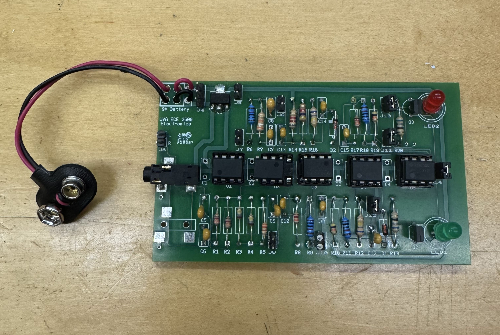
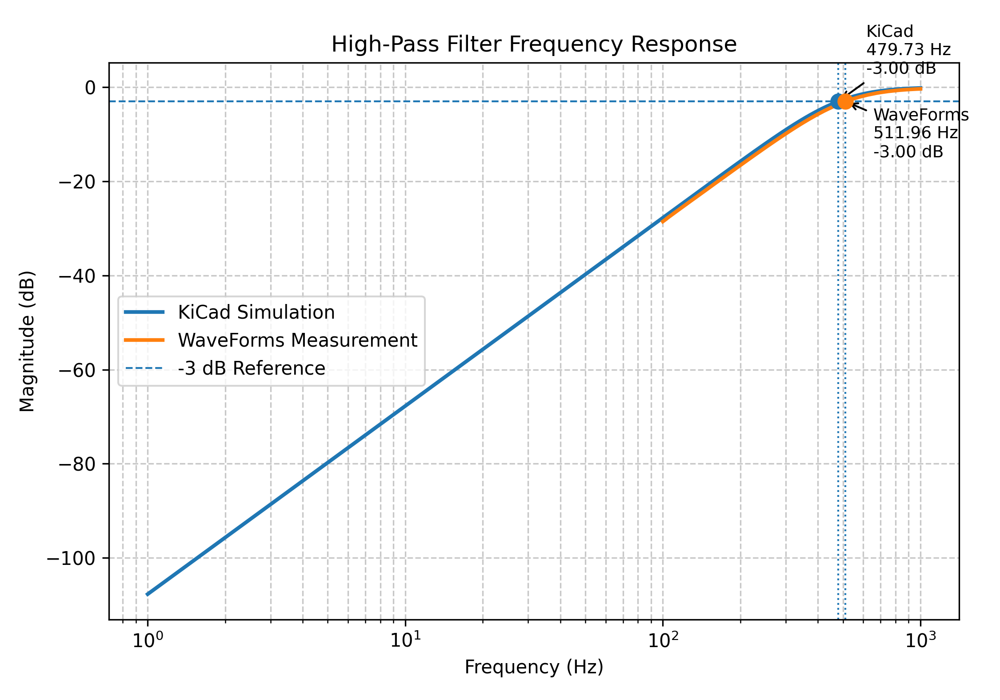
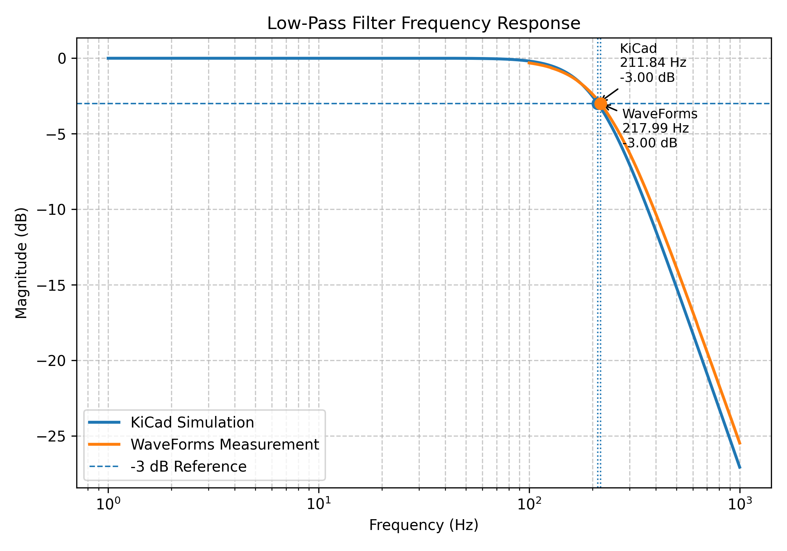
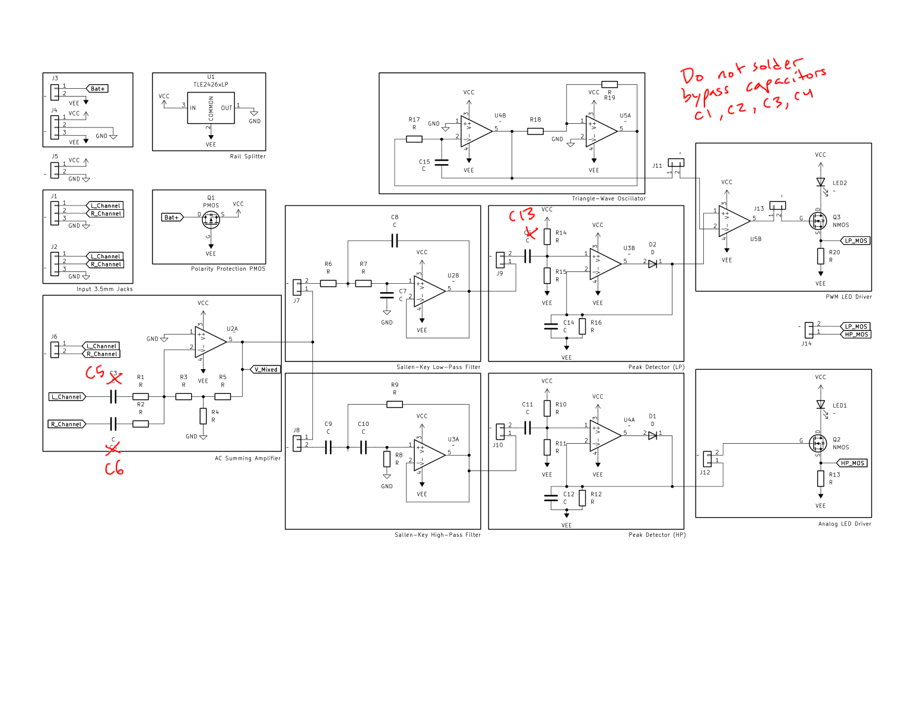

# Audio Analyzer — Sallen-Key filter design and measurement

A battery-powered analog audio analyzer that splits a stereo input into two bands and drives an
LED from each. The circuit runs entirely on op-amps and discrete parts (no microcontroller, no
DSP) from a single 9 V cell.



I designed the two filter stages that set what the analyzer actually responds to: picking the
corner frequencies, solving the Sallen-Key equations for every resistor and capacitor, simulating
the result in KiCad, assembling the board, and then measuring the real hardware against the
prediction on a network analyzer. Both corners came in within 3.7 % of the hand calculation.
Full derivation and method in [`docs/report.pdf`](docs/report.pdf).

---

## Signal chain

```
3.5 mm in ──▶ AC summing ──┬──▶ Sallen-Key ──▶ peak ──▶ comparator ──▶ PWM ──▶ LED2
   (L + R)      amp        │      low-pass      detector      ▲        NMOS
                           │                                  │
                           │                        triangle-wave osc
                           │
                           └──▶ Sallen-Key ──▶ peak ──────────────────▶ NMOS ──▶ LED1
                                  high-pass      detector
```

Power comes from one 9 V battery through a PMOS polarity-protection stage into a TLE2426 rail
splitter, which synthesizes the mid-supply reference the op-amps need to swing both ways on a
single cell. The eight op-amp stages are four LMC6482 duals (U2–U5).

Every block is separated by a header (J7–J14), so a stage can be unshunted and driven or probed
on its own — that is how the filter measurements below were taken without the rest of the chain
loading the result.

## The filter stage

Both filters are second-order **Sallen-Key** sections with the op-amp wired as a unity-gain
buffer, so `K = 1` and the corner frequency reduces to

```
f_c = 1 / (2π · √(R₁R₂C₁C₂))
```

The low-pass sits below the high-pass corner, so the two LEDs respond to genuinely different parts
of the spectrum — bass energy on one, upper-mid on the other.

### Results

Simulated in KiCad, then measured on the assembled board with an Analog Discovery driving a 1 V
sinusoid through a logarithmic sweep and its network analyzer recording the response.

| Filter | Theoretical `f_c` | KiCad | Measured | Error vs theory |
|---|---|---|---|---|
| High-pass | 493.9 Hz | 479.73 Hz | 511.96 Hz | 3.66 % |
| Low-pass | 210.6 Hz | 211.84 Hz | 217.99 Hz | 3.51 % |





Both measured corners land within about 3.5 % of the hand calculation, and the measured curve
tracks the simulation across the whole sweep rather than only at the corner. The residual error is
what you would expect from 5 % passive tolerances, board parasitics, and the finite gain-bandwidth
of the LMC6482 — the design equations assume an ideal op-amp, and the measured corner sits *above*
theory in both cases, which is the direction component tolerance and input capacitance push it.

## Schematic



The red annotations are build notes: the bypass capacitors C1–C4 and the input coupling caps
C5/C6, plus C13, are left unpopulated on this build.

## Repository layout

```
docs/filter-design-report.pdf   my write-up: derivation, method, results, discussion
docs/schematic.pdf              full schematic with build annotations
figures/                        response plots and the schematic as images
images/board.jpg                assembled board
images/board-original.jpg       the same photo, uncut
```

## Tools

KiCad (schematic capture and simulation) · Digilent Analog Discovery with WaveForms (waveform
generator and network analyzer) · hand soldering, through-hole
